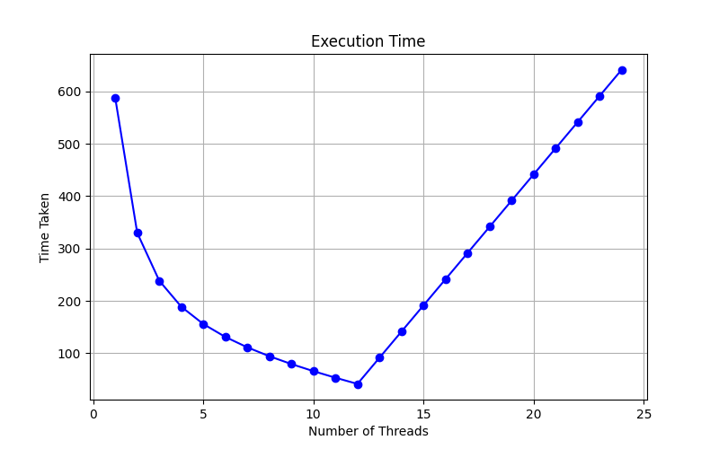

# Multithreading Dashboard

A Flask-based mini project that demonstrates Python multithreading with a simple web interface.

## Features

- Dashboard with 6 rectangular boxes for random integer display
- Each box uses its own integer range and refresh time
- Boxes stay empty on first load or reload
- Multithreading task starts only when the user clicks **Run Multithreading Task**
- While the backend task is running, the button shows a loading state
- After completion, random values start refreshing automatically
- A **Stop Task** button stops all automatic refresh intervals
- Output files are generated by the backend:
  - Table output
  - Graph output


## How the Website Works
1. Click **Run Multithreading Task**.
2. The button changes to a loading state until the backend finishes execution.
3. After completion:
   - random integers start appearing in the boxes,
   - each box refreshes automatically using its own refresh time,
   - output files are generated by the backend.
4. Click **Stop Task** to stop all box updates.

## Setup and Run

### 1. Install dependencies

```bash
pip install -r requirements.txt
```

### 2. Run the Flask app

```bash
python app.py
```
``

## Output

# Table Output

[Download Table File](output/thread_table.csv)

# Graph Output




## Notes

- Maximum number of threads is set to:

```text
2 × number of CPU cores
```

- Each box can have a different:
  - random integer range
  - refresh time
